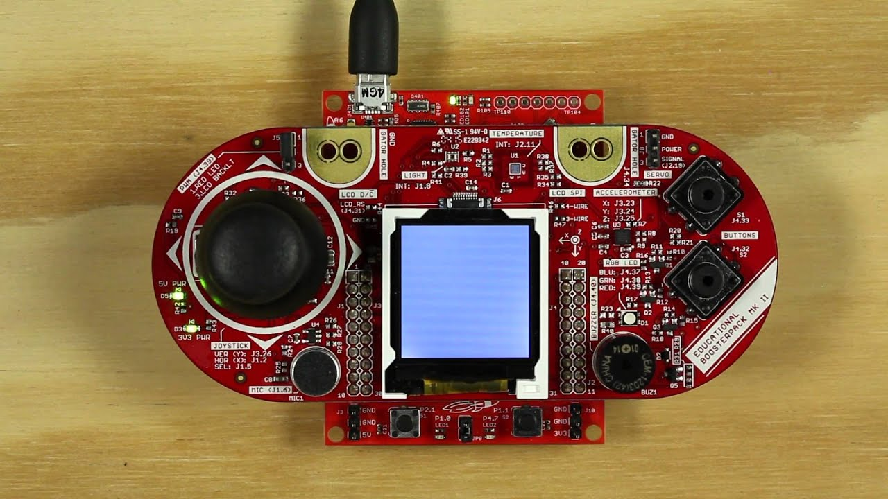

# TM4C_Game_controller
TM4C123GXL Launchpad Game controller using MKII Boosterpack with USB HID interface

# Overview
This is code for a game controller for a TM4C123GXL Evaluation board combined with an MKII boosterpack. It communicates to the host via USB HID. 
It runs FreeRTOS and has a sophisticated serial debug interface. All that is required for this project is an MKII Boosterpack and TM4C123GXL launchpad.

The main purpose of this project is to demonstrate a professional approach to FreeRTOS development to novices. Although it is just a simple USB HID game controller, 
the code under the hood is rather sophisticated. All tasks are non-blocking and the serial debug interface has a system of pages which provide GPIO control,
an error logger, a task manager, and live streaming of ADCs and I2C registers.  

Note: I never finished the watchdog task for this project because I moved on to something else, so that code can and should be ignored.

# Setup
Connect MKII Boosterpack to TM4C123GXL Evaluation board. 
Connect both USB ports to a host computer. 
Flash the .out file to the TM4C using LMFLash. 
Use putty to connect to the TI stellaris virtual COM port. 
Press TAB to toggle through the serial debug "pages"
Run the python script in the scripts directory to stream HID values on the HOST computer. 

